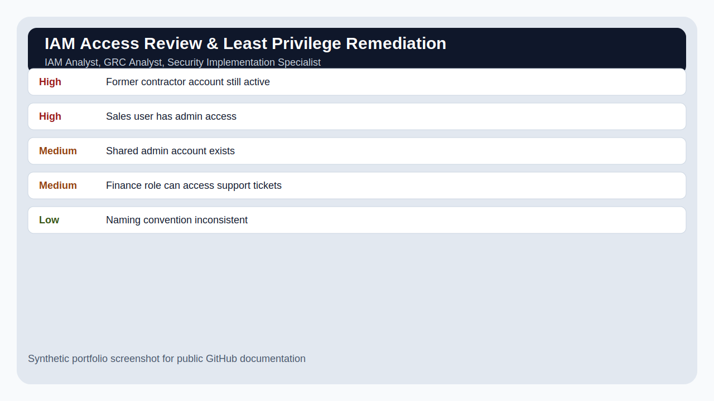

# IAM Access Review & Least Privilege Remediation

## Overview

A simulated identity and access management review showing how to assess user permissions, identify excessive access, recommend role-based access control, and document offboarding controls.

## Scenario

A growing SaaS operations team has accumulated permissions over time. Leadership wants to reduce excessive access before a customer security review.

## Target Roles

IAM Analyst, GRC Analyst, Security Implementation Specialist

## Tools and Concepts Used

Google Workspace or Microsoft Entra-style concepts, RBAC matrix, CSV review data, audit checklist

## Key Findings

| Severity / Type | Finding | Why It Matters |
|---|---|---|
| High | Former contractor account still active | Offboarding gap creates unauthorized access risk. |
| High | Sales user has admin access | Permission does not match job function. |
| Medium | Shared admin account exists | No accountability or user-level audit trail. |
| Medium | Finance role can access support tickets | Possible exposure to unnecessary customer data. |
| Low | Naming convention inconsistent | Makes access review harder and increases operational error. |

## What I Did

1. Defined the scope and business scenario.
2. Reviewed synthetic evidence/data.
3. Identified security issues and mapped them to business risk.
4. Prioritized findings by severity and likelihood.
5. Wrote remediation or improvement recommendations.
6. Documented the project in a way a recruiter, hiring manager, or technical reviewer can follow.

## Screenshots

## Interview Explanation

This project shows I understand the business side of security: people need access to work, but excessive access creates risk. I can document who has access, why it matters, and how to fix it without breaking operations.

## How to Confidently Explain This Project

Use this structure:

1. **Situation:** Explain the business problem.
2. **Task:** Explain what security question you were trying to answer.
3. **Action:** Explain your investigation or review steps.
4. **Result:** Explain what you found and what you recommended.

Example:

> I created this project to practice the workflow used by security teams: define scope, collect evidence, identify risk, prioritize what matters, and communicate next steps. I used synthetic data so the project is safe to publish, but the process mirrors how entry-level analysts contribute in real environments.

## Beginner Mistakes This Project Avoids

- Listing tools without explaining the security outcome.
- Treating every alert or finding as equally important.
- Forgetting to explain business impact.
- Publishing real logs, IP addresses, client data, or secrets.
- Writing notes that only the author can understand.

## Files Included

- `README.md` - Project overview and explanation.
- `data/sample-data.csv` - Synthetic evidence used for the project.
- `reports/final-report.md` - Polished report-style writeup.
- `screenshots/project-summary.svg` - Public-safe screenshot mockup.
