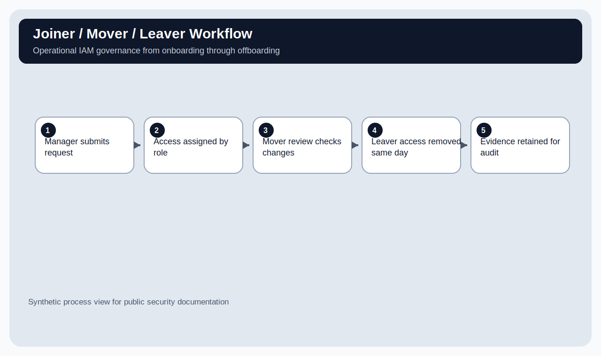

# IAM Access Review & Least Privilege Remediation

## Overview

This repository contains an identity and access management governance package for a simulated small business. It demonstrates how access is requested, approved, reviewed, reduced, and removed using least privilege and role-based access control.

The work is built around operational IAM, not just policy writing. It includes access review evidence, a role-based access matrix, privileged access approval workflow, MFA enforcement tracking, and joiner/mover/leaver process documentation.

> All users, systems, access levels, and evidence are synthetic and safe for public use.

---

## Business Scenario

Northstar Dental Billing LLC has grown quickly and accumulated access across email, file storage, billing, CRM, project management, and admin consoles. The company needs a repeatable process to reduce excessive access, remove former users, validate privileged access, and prepare for customer security reviews.

The IAM review answers five questions:

1. Who has access?
2. Does access match the user’s role?
3. Which access should be kept, reduced, removed, or approved?
4. Which systems require MFA?
5. What evidence proves access was reviewed?

---

## Target Roles

| Role | Why This Repository Fits |
|---|---|
| IAM Analyst | Shows access review, RBAC, privileged access, MFA enforcement, and JML lifecycle |
| GRC Analyst | Demonstrates access governance, evidence retention, and review cadence |
| Security Implementation Specialist | Connects SaaS administration to security process design |
| Security Solutions Consultant | Shows how IAM controls support customer assurance and operational security |

---

## Core Deliverables

| Area | Deliverables |
|---|---|
| Access Governance | Access request form, quarterly review process, decision criteria |
| JML Lifecycle | Joiner/mover/leaver workflow and offboarding evidence |
| RBAC | Role-based access matrix and approved access examples |
| Privileged Access | Admin approval workflow and privileged access register |
| MFA Governance | MFA enforcement matrix by system and user population |
| Evidence | CSV review data, screenshots, remediation tracker, final report |

---

## Joiner / Mover / Leaver Workflow



---

## Access Review Dashboard

The access review sheet shows how user access is reviewed against role, business need, and least privilege.


---

## Role-Based Access Matrix

The RBAC matrix defines approved access by role so access decisions are consistent and auditable.


---

## MFA Enforcement Matrix

The MFA matrix connects authentication requirements to systems and user populations.


---

## Privileged Access Register

Privileged access is tracked separately because admin rights require stronger approval and review.


---

## Repository Structure

```text
.
├── README.md
├── CHANGELOG.md
├── COMMIT_GUIDE.md
├── iam-governance/
├── evidence/
├── data/
├── technical-validation/
├── reports/
├── screenshots/
└── templates/
```

---

## Key Evidence Files

| File | Purpose |
|---|---|
| `data/access-review-sample.csv` | Quarterly access review sample |
| `data/rbac-matrix.csv` | Approved access by role |
| `data/mfa-enforcement-matrix.csv` | MFA requirement tracking |
| `data/privileged-access-register.csv` | Admin access decision evidence |
| `iam-governance/joiner-mover-leaver-workflow.md` | Access lifecycle workflow |
| `iam-governance/quarterly-access-review-process.md` | Repeatable access review process |
| `reports/final-report.md` | Summary of review decisions and remediation |

---

## How This Would Operate in a Real Company

1. Managers submit access requests based on job role.
2. Access is assigned using the RBAC matrix.
3. Privileged access requires documented approval.
4. Role changes trigger mover reviews.
5. Departures trigger same-day access removal.
6. Quarterly access reviews confirm access is still appropriate.
7. Evidence is retained for customer assurance and audit readiness.

---

## Limitations

This is not a production IAM audit or SOX control test. It is a synthetic IAM governance package that demonstrates access review logic, least privilege, and operational process design.
