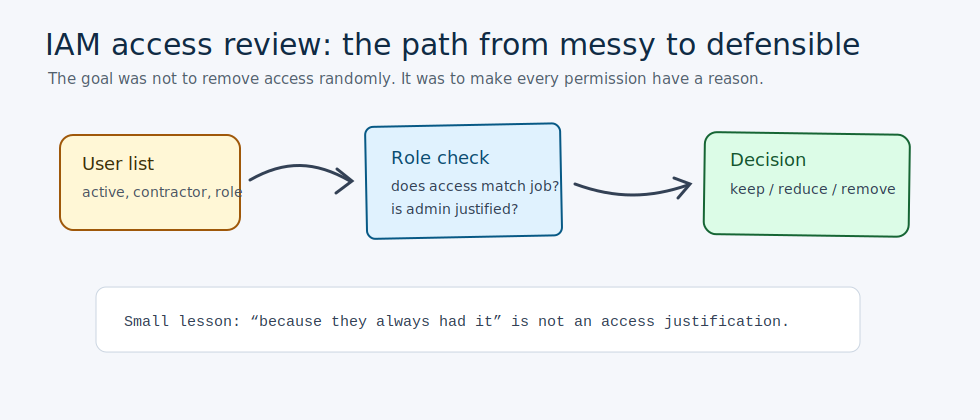
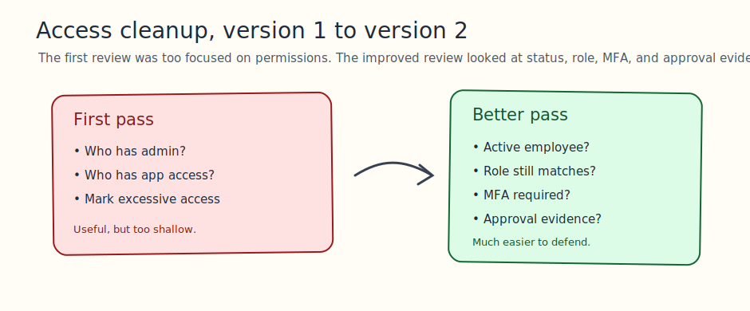
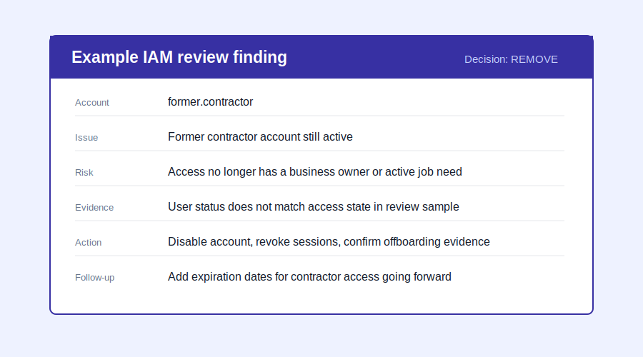
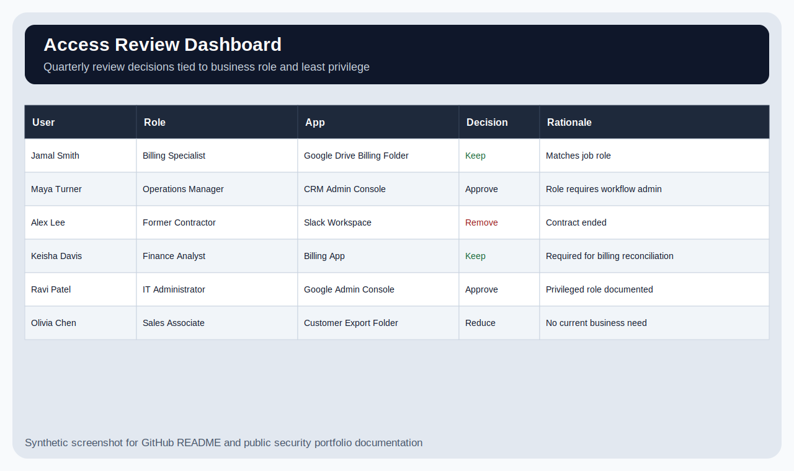
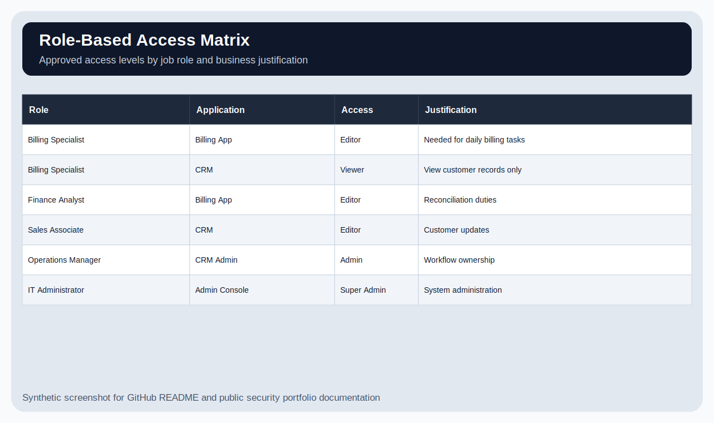
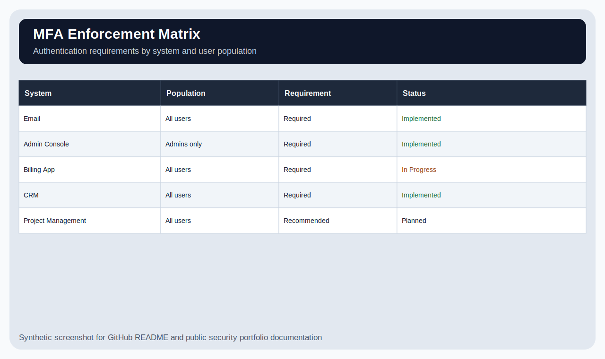
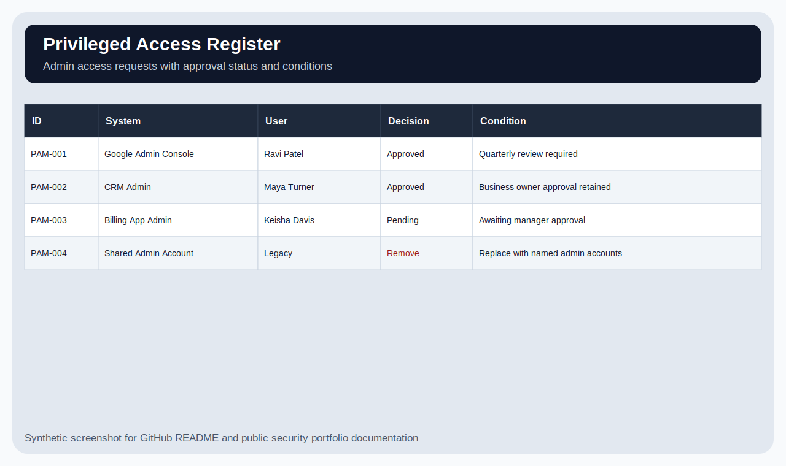

<div align="center">

# IAM Access Review & Least Privilege Remediation

**A practical IAM governance lab focused on access review, role fit, MFA, and cleanup decisions**  
User access + least privilege + privileged access review + JML workflow

   

</div>

---

## What this project demonstrates



This is an IAM governance lab for a simulated small business. I reviewed synthetic access data to decide which access should be kept, reduced, removed, approved, or investigated.

The project is intentionally practical. It is the kind of cleanup that happens in real SaaS environments: someone changed roles, a contractor stayed active too long, a user has more access than they need, and admin access needs a better approval trail.

All names, systems, and access decisions are synthetic.

---

## Skills used

| Skill | How it shows up here |
|---|---|
| IAM access review | Reviewed access by user, role, system, and business need. |
| Least privilege | Recommended keep, reduce, remove, approve, or investigate decisions. |
| Privileged access review | Separated standard access from admin-level access. |
| MFA governance | Mapped systems to MFA expectations and enforcement gaps. |
| Joiner/mover/leaver thinking | Connected access decisions to onboarding, role changes, and offboarding. |
| Risk documentation | Explained why access was risky instead of only saying “too much access.” |
| SaaS implementation mindset | Treated IAM as a process and ownership problem, not just a checkbox. |

**Estimated time to build/recreate:** ~7–10 hours across several focused sessions.  
IAM looks simple until you try to explain why someone still has access. Then the spreadsheet starts asking life questions.

---

## Quick visual tour

| Review logic | Example access finding |
|---|---|
|  |  |

| Access review dashboard | RBAC matrix |
|---|---|
|  |  |

| MFA enforcement matrix | Privileged access register |
|---|---|
|  |  |

---

## What I reviewed

| Evidence | Location |
|---|---|
| Access review sample | `data/access-review-sample.csv` |
| RBAC matrix | `data/rbac-matrix.csv` |
| MFA enforcement matrix | `data/mfa-enforcement-matrix.csv` |
| Privileged access register | `data/privileged-access-register.csv` |
| JML workflow | `iam-governance/joiner-mover-leaver-workflow.md` |
| Quarterly review process | `iam-governance/quarterly-access-review-process.md` |
| Analyst journal | `docs/analyst-journal.md` |

---

## One example access review finding

| Field | Detail |
|---|---|
| Finding | Former contractor account still active |
| Decision | Remove |
| Affected access | Application access still assigned after the user no longer had an active business need |
| Evidence | User status did not match access state in the review sample. |
| Risk | Former users should not retain access because ownership and accountability are unclear. |
| Recommended action | Disable account, revoke active sessions, confirm offboarding evidence, and document closure. |
| Follow-up | Add expiration dates for contractor access going forward. |

I intentionally did not treat every issue the same way. A former contractor account is a different kind of problem than a current employee needing slightly reduced permissions.

---

## Access decisions

| Decision | Analyst reasoning |
|---|---|
| Keep | Access matched role and business need. |
| Reduce | User still needed access, but not at the current permission level. |
| Remove | Access no longer had a valid business reason. |
| Approve | Privileged access was justified but needed explicit documentation. |
| Investigate | More context would be needed before changing access. |

---

## Project structure

```text
IAM-Access-Review-Least-Privilege/
├── data/                         # Synthetic access, RBAC, MFA, and privileged access data
├── docs/                         # Analyst journal and portfolio visuals
│   └── images/                   # README visuals
├── iam-governance/               # JML and quarterly access review process notes
├── screenshots/                  # Original SVG screenshots from the lab
└── README.md
```

---

## What I got wrong first

My first pass focused mostly on admin rights. That was a useful starting point, but it was not enough. A user can have non-admin access that is still risky if they no longer work with the company, changed roles, or have no valid owner.

I changed the review to consider user status, role fit, MFA, approval evidence, and whether the access still had a business reason. That made the work feel much more like real IAM and less like “find the biggest permission and panic.”

More notes are in `docs/analyst-journal.md`.

---

## What I could confirm

- The access review process identifies keep, reduce, remove, approve, and investigate decisions.
- Role-based access examples are documented.
- MFA requirements are mapped by system.
- Privileged access is separated from standard access.

## What I could not confirm

- No real SaaS admin export was reviewed.
- No live identity provider was checked.
- The access review does not prove SOX compliance.
- The RBAC matrix is a starting point and would need business owner validation.

---

## What I would improve next since Rome did not review admin access in one quarter

1. Add a lab export from Google Workspace, Microsoft Entra, Okta, or another SaaS admin console.
2. Track one access review cycle from request to remediation.
3. Add evidence of removed or reduced access.
4. Add temporary access expiration examples.
5. Add a mock manager sign-off workflow.

---

## Important note

This is a defensive IAM portfolio lab using fictional data. It is meant to show access review reasoning and documentation habits, not to claim production IAM administration experience.
